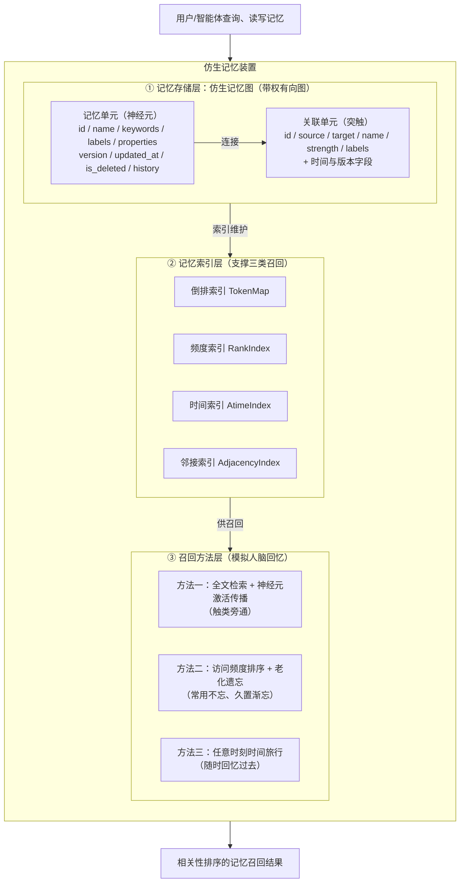
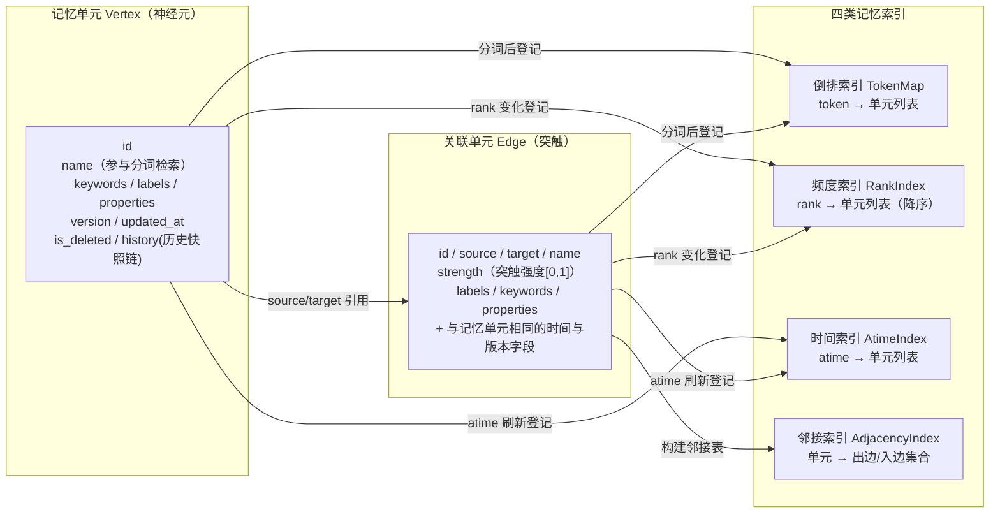
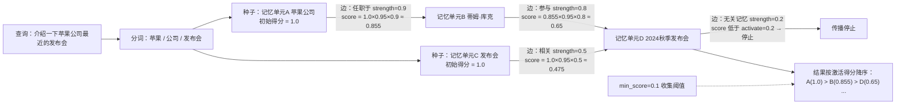
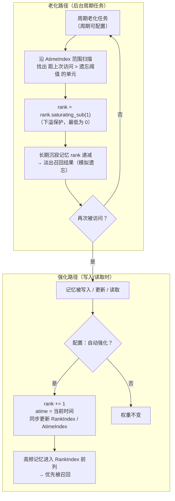
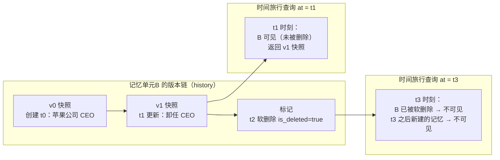

# 一种AI智能体仿生记忆装置和召回方法

> 发明名称：一种AI智能体仿生记忆装置和召回方法
> 技术领域：人工智能 / 智能体（Agent）记忆系统 / 图计算与信息检索

---

## 摘要

本发明公开了一种AI智能体仿生记忆装置和召回方法，属于人工智能技术领域。本装置以带权有向图作为记忆的底层数据结构，其中记忆单元（顶点）与关联单元（边）分别对应人脑的神经元与突触，边权重对应突触强度；装置维护倒排索引、频度索引与时间索引三类记忆索引。召回方法包括：其一，以全文检索结果作为激活种子，沿关联单元的强度在记忆图中进行衰减式激活传播，实现相关性记忆的扩散召回；其二，依据访问频度实时增减记忆权重，并对长期未访问的记忆进行周期性的老化衰减，模拟人脑的强化与遗忘；其三，记忆单元携带版本与时间戳信息，支持在任意指定时刻回溯召回历史记忆状态，且时间维度可叠加于上述两种召回方法之上。本发明解决了现有RAG、结构化文本、传统知识图谱与传统数据库等AI智能体记忆装置缺乏关联扩散、缺乏频度强化与遗忘、缺乏时间回溯能力的缺陷，使AI智能体能够像人脑一样"触类旁通地想起、常用不忘、久置渐忘、随时回忆过去"。

---

## 一、Idea产生的背景与现有技术

### 1.1 技术领域

本发明涉及人工智能技术领域，具体涉及一种AI智能体的记忆装置及其记忆召回方法，可应用于大语言模型驱动的智能体（Agent）、对话系统、个人助理、具身智能、自主规划系统等需要长期记忆与上下文回忆的场景。

### 1.2 背景：AI智能体记忆装置与人脑记忆的差距

人脑的记忆机制具有以下显著特点：

1. **关联扩散性**：记忆并非孤立存储，而是通过神经元与突触相互连接。回忆一个记忆时，会沿突触自动激活与之相关联的其它记忆——例如提到"苹果"会连带想起"库克""发布会""iPhone"等，即"触类旁通"。
2. **频度强化与遗忘**：经常被想起的记忆会不断被强化而变得牢固；长期不被想起的记忆则随艾宾浩斯遗忘曲线逐渐淡忘，其重要性与可召回性自然衰减。
3. **时间线索**：人脑的每段记忆都带有时间上下文，人能够回答"我当时做了什么""上个月我们讨论了什么"，即按任意时刻回溯历史记忆。
4. **渐进式学习**：新记忆即时写入并即时参与回忆，无需重新训练整体模型。

然而，当前主流的AI智能体记忆装置在上述四个方面均与人脑存在显著差距：要么只支持孤立的精确/相似度匹配、要么所有记忆权重相同永不忘却、要么无法按时间回溯。随着AI智能体承担越来越复杂的长期任务，其记忆装置"只会存取、不会像人一样回忆"的缺陷已成为制约智能体能力的核心瓶颈。

### 1.3 现有AI智能体记忆装置及其关键缺点

本部分对比四类典型的AI智能体记忆装置：RAG（检索增强生成）、结构化文本（Markdown，典型代表 OpenClaw）、传统知识图谱、传统数据库（典型代表 Hermes）。以下关键缺点均经联网检索印证（文献/官方资料见各节末"联网检索佐证"）。

#### （1）RAG（检索增强生成）

**工作原理**：将文档切分为片段（chunk），经嵌入模型（embedding）向量化后存入向量数据库；召回时将用户查询向量化，通过余弦相似度等度量检索最相似的片段，拼入上下文供大模型生成回答。

**关键缺点**：

- **检索结果彼此孤立**：相似度检索只返回与查询向量最接近的若干片段，片段之间没有显式关联；无法沿"苹果→库克→发布会"这样的多跳路径扩散召回，缺乏关联扩散能力。
- **无频度强化与遗忘机制**：向量表示一旦生成基本固定，不随访问频度、使用重要性动态变化；所有记忆的权重相同，热门记忆与冷门记忆在检索时被同等对待，不符合人脑"常用不忘、久置渐忘"的特性。
- **冷启动依赖嵌入模型**：新知识入库需要重新向量化，且检索质量依赖嵌入模型与切块策略。
- **无时间维度**：无法回答"某一时刻的记忆状态是什么"，不支持按时间点回溯。

**联网检索佐证**：RAG 领域权威综述《Retrieval-Augmented Generation for Large Language Models: A Survey》（arXiv:2312.10997，Gao et al.，2023-2024）系统梳理了 Naive/Advanced/Modular RAG 各范式，明确指出 RAG 的检索环节以"向量相似度召回片段"为核心，其召回单元是彼此孤立的文本片段（chunk），缺乏片段间的显式关联与多跳扩散能力，且面临检索质量依赖嵌入模型、上下文噪声、无法追踪推理过程等挑战——与上述缺点分析一致。

#### （2）结构化文本（Markdown，典型代表 OpenClaw）

**工作原理**：将记忆以 Markdown、纯文本或 JSON 等结构化文本形式存储为文件，智能体通过读写文件、全文/关键词匹配来检索记忆。

**关键缺点**：

- **无显式实体关联**：文本中实体之间没有可计算的连接结构，无法表达"谁认识谁""什么属于什么"等关系，召回只能依赖字符串匹配。
- **召回能力弱**：仅支持关键词/全文匹配，无法实现基于相关性的扩散召回；近义表达、间接关联均无法召回。
- **无频度权重与遗忘**：所有记忆文件权重相同，不随使用频度强化，也不会老化遗忘，记忆库只会无限膨胀、信噪比不断下降。
- **无版本与时间回溯能力**：文件覆盖写后旧状态即丢失，无法回溯任意时刻的历史记忆。

**联网检索佐证**：OpenClaw 为开源个人AI助手项目（GitHub: openclaw/openclaw，截至检索时约 38.6 万 star，2025-11 创建），其前身为基于 Claude Code 生态的 Clawdbot；按官方文档，其长期记忆以项目内 Markdown/文档文件（如 CLAUDE.md 类文件、soul.md 及记忆目录）形式存储，由智能体直接读写文件实现记忆的存取，本质上仍是"文件即记忆"的结构化文本方案，检索依赖文件系统与关键词，不具有实体关联图、频度权重演化与时间回溯能力，与上述缺点分析一致。

#### （3）传统知识图谱

**工作原理**：以"实体—关系—实体"三元组构建静态知识图谱，通过 SPARQL、Cypher 等图查询语言进行精确的模式匹配查询。

**关键缺点**：

- **查询依赖精确模式匹配**：召回必须先给出确切的实体名与关系类型，不支持基于相关性的模糊/扩散召回；当用户提问是开放式的（"和某某有关的一切"）时，传统图查询难以表达。
- **不感知访问频度**：图谱是静态结构，查询热度不会改变实体的权重与排序，无法体现记忆的强弱。
- **无遗忘机制**：实体一旦入库永远存在且权重不变，不符合生物记忆的遗忘规律。
- **通常无历史版本**：多数知识图谱不支持任意时刻的状态回溯，删除或更新后旧状态不可恢复。

**联网检索佐证**：主流图数据库（如 Neo4j、JanusGraph）与 SPARQL/Cypher 查询规范均以"当前状态"的精确模式匹配为核心语义；查询必须预先指定实体/关系/属性的确切模式，无法对开放式自然语言输入做相关性扩散召回。时态图（temporal graph）虽有学术研究，但主要面向事务审计与版本管理，未见面向AI智能体记忆召回语义的工程化装置。

#### （4）传统数据库（典型代表 Hermes）

**工作原理**：以关系表或键值对存储结构化记忆，通过 SQL 等查询语言进行精确检索与过滤。

**关键缺点**：

- **查询必须精确结构化**：必须明确表结构、字段与过滤条件，无法针对自然语言输入进行相关性召回；数据库对"模糊的、开放式的回忆请求"无能为力。
- **无记忆权重与排序**：数据行的价值等同，没有按访问频度/重要性动态排序的机制，更无遗忘逻辑。
- **时间旅行成本高**：虽可通过时间戳列 + 手工快照近似实现历史查询，但需要应用层显式设计，查询复杂、存储开销大，并非记忆语义上的任意时刻回溯。

**联网检索佐证**：Hermes 为开源 AI 智能体（Nous Research 生态，GitHub 仓库含 hermes-agent / hermes-workspace 等，检索时 2025-2026 活跃），其记忆与对话历史以传统数据库（数据库表/键值存储）持久化，检索依赖结构化查询与关键词过滤；此类"数据库即记忆"方案检索必须精确构造查询条件，无法针对模糊、开放式回忆请求做相关性扩散召回，也无内建的记忆权重演化与任意时刻回溯语义，与上述缺点分析一致。

### 1.4 仿生人脑进行记忆召回的必要性

综合上述分析，现有四类记忆装置分别解决了存储与检索的某一方面问题，但**均缺少"关联扩散、频度强化与遗忘、时间回溯"三者一体的仿生记忆机制**：

- 智能体需要"触类旁通"的相关性回忆能力，而不是孤立的精确匹配；
- 智能体需要像人一样"常用强化、久置遗忘"，以控制记忆规模、提高召回信噪比；
- 智能体需要"随时回忆过去任意时刻的记忆"，以支持自我反思、长期规划与可解释决策。

因此，有必要设计一种仿生人脑记忆机制的AI智能体记忆装置和召回方法：以带权记忆图模拟神经元网络，以全文检索结果作为激活种子、沿突触强度衰减传播实现相关性召回，以访问频度索引实现强化与老化遗忘，以版本与时间戳实现任意时刻的历史回溯。

---

## 二、本发明的技术方案

### 2.1 总体构思

本发明将AI智能体的记忆建模为一个**仿生记忆图**，从"存储结构"与"召回方法"两个层面模拟人脑：

| 人脑机制 | 本发明对应实现 |
|----------|----------------|
| 神经元 | 记忆单元（顶点）：一个概念/实体/事件 |
| 突触与突触强度 | 关联单元（边）及其强度权重：实体间关系的紧密程度 |
| 外部刺激触发初始激活 | 全文检索：将查询文本分词后经倒排索引命中初始种子集合 |
| 激活沿突触扩散并衰减 | 沿记忆图按"得分 × 衰减系数 × 边强度"做广度优先激活传播，直至低于激活阈值 |
| 常用强化 | 读取/更新记忆时频度权重自增，进入高频排序索引 |
| 遗忘 | 后台周期扫描时间索引，对长期未访问的记忆做老化衰减 |
| 记忆的时间上下文 | 记忆单元携带创建/更新时间戳、版本号与历史快照链，支持任意时刻回溯 |

**装置总体原理图**：



### 2.2 记忆数据结构设计

本发明的记忆装置包含如下核心数据结构（与具体存储引擎、网络协议、前端展示等工程设计无关）：

**（1）记忆单元（顶点，对应神经元）**

```
记忆单元 = {
  id            : 唯一标识
  name          : 记忆名称（概念名/实体名/事件名，参与分词检索）
  keywords      : 附加检索关键词
  labels        : 类型标签（如"人物""项目""事件"）
  properties    : 自定义属性键值对
  // 时间与版本字段（支撑保护点3）
  version       : 单调递增版本号
  updated_at    : 最后更新时间戳（微秒级）
  is_deleted    : 软删除标记
  history       : 历史快照链（每次变更前的完整状态快照）
}
```

**（2）关联单元（边，对应突触）**

```
关联单元 = {
  id            : 唯一标识
  source        : 源记忆单元 id
  target        : 目标记忆单元 id
  name          : 关系名称（如"任职于""朋友"）
  strength      : 突触强度 [0,1]，激活传播时的衰减因子
  labels        : 关系类型标签
  keywords      : 附加关键词
  properties    : 自定义属性
  // 与记忆单元相同的时间与版本字段
}
```

**（3）三类记忆索引（用于快速召回）**

```
倒排索引 TokenMap : token → 命中记忆单元/关联单元列表   （支撑全文检索，保护点1的种子来源）
频度索引 RankIndex: rank → 记忆单元/关联单元列表，按 rank 降序 （支撑保护点2）
时间索引 AtimeIndex: atime → 记忆单元/关联单元列表         （支撑老化扫描与时间过滤）
邻接索引 AdjacencyIndex: 记忆单元 → 出边/入边集合          （支撑激活传播）
```

其中 `rank` 为访问频度权重：记忆被读取或更新时 `rank += 1`；长期不被访问时经老化任务递减。`atime` 为最近一次被访问的时间戳。

**数据结构组成图**：



```text
（ASCII 示意：一条记忆及索引的登记关系）
  token ──倒排──▶ [记忆单元A]──边:任职于(strength=0.9)──▶[记忆单元B]
                     │  ▲                                  │
              rank/atime 登记                    rank/atime 登记
                     ▼  │                                  ▼
              [RankIndex/AtimeIndex]             [RankIndex/AtimeIndex]
```

### 2.3 召回方法一：基于全文检索结果的神经元激活传播（保护点1）

**目的**：从自然语言查询出发，召回与查询相关的记忆以及与之"触类旁通"的关联记忆，并按相关性（激活得分）排序。

**步骤**：

1. **分词与种子命中**：接收查询文本，经分词器切分为 token 序列；对每个 token 查询倒排索引 TokenMap，得到命中集合。支持两种命中模式：
   - 宽松模式（greedy）：任一 token 命中即纳入种子，按命中频率计初始得分（并集）；
   - 精确模式（exact）：要求所有 token 均命中的记忆才纳入种子（交集），初始得分按命中比例计算。
2. **初始激活**：将种子集合中的记忆单元作为激活种子，赋予初始激活得分。
3. **激活传播**：从种子出发，沿邻接索引做广度优先遍历；每次沿一条关联单元传播时，后继记忆单元的激活得分按如下公式计算：

   ```
   score(后继) = score(当前) × decay × strength(关联单元)
   ```

   其中 `decay` 为全局衰减系数（可配置，默认 0.95），`strength` 为该关联单元的突触强度；传播每深一层，得分按衰减系数指数级下降，天然形成"相关性随距离衰减"的排序。
4. **阈值控制**：当某条传播路径的得分低于激活阈值 `activate` 时停止该路径的传播（防止激活无限扩散）；传播深度受最大深度 `max_depth` 限制。
5. **结果收集与排序**：收集激活得分不低于最低得分阈值 `min_score` 的记忆单元（种子记忆与扩散关联记忆），按激活得分降序输出，即得到相关性记忆召回结果。

**关键特征**：召回结果不仅包含与查询直接匹配的记忆，还包含经由"强突触"连接的多跳关联记忆——如同人脑被一个关键词唤醒后连带想起的相关往事。

**激活传播示意图**（以"苹果公司发布会"查询为例）：



### 2.4 召回方法二：基于访问频度的排序与老化记忆（保护点2）

**目的**：使记忆权重随使用情况动态演化——常用记忆保持高权重、优先被召回；长期不用的记忆逐渐老化、权重衰减直至淡出召回结果，模拟人脑的强化与遗忘。

**步骤**：

1. **频度强化（写入路径）**：当记忆单元被写入、更新或读取时：
   - `rank += 1`（是否计入读取/更新可由配置开关控制）；
   - 刷新 `atime = 当前时间`；
   - 更新频度索引 RankIndex 与时间索引 AtimeIndex。
2. **频度排序（召回路径）**：当需要按记忆重要程度召回时（例如无查询词的"最近重要记忆"、或作为排序过滤器），沿频度索引按 `rank` 降序取 Top-N 记忆，或对已有召回结果按 `rank` 降序重排；亦可设定最低 rank 阈值进行过滤。
3. **老化遗忘（后台路径）**：周期性执行老化任务（周期可配置）：
   - 沿时间索引 AtimeIndex 范围扫描出"距上次访问超过遗忘阈值 `inactive_after`"的记忆单元与关联单元；
   - 对这些单元执行 `rank = rank.saturating_sub(1)`（下溢保护，最低为 0）；
   - 同步更新频度索引与时间索引。
4. **配置化**：强化/老化行为全部可配置，包括"读取是否强化""更新是否强化""是否启用老化""遗忘时间阈值""老化扫描周期"，以适应不同智能体的记忆策略。

**关键特征**：记忆的重要性不是静态属性，而是随访问历史动态演化；被反复回忆的记忆越来越容易被再次召回，长期沉寂的记忆逐渐"被遗忘"，从而控制记忆规模、提高召回信噪比。

**频度强化与老化遗忘流程图**：



### 2.5 召回方法三：任意时刻的时间旅行召回（保护点3）

**目的**：支持在任意指定时刻（微秒级时间戳）召回当时的记忆状态——"智能体的记忆快照"，回答"在那一刻，智能体记得什么"。

**步骤**：

1. **版本化写入**：记忆单元/关联单元带版本号与时间戳；每次更新时先将当前完整状态压入历史快照链（写时复制），再更新 `version += 1`、`updated_at = 当前时间`。
2. **软删除**：删除记忆时默认置 `is_deleted` 标记并保留历史快照链（支持硬删除以彻底清除）。
3. **时间过滤**：执行任何召回（全文检索、激活传播、频度排序）时，若指定时间点 `t`，对候选记忆单元做如下过滤：
   - 排除 `created_at > t` 的记忆（在 t 时刻尚未存在的记忆不可见）；
   - 排除在 t 之前已被软删除的记忆（在 t 时刻已被遗忘的记忆不可见）；
   - 对保留的记忆单元，取其历史快照链中"最接近且不晚于 t"的版本快照作为当时的记忆状态返回。
4. **维度叠加**：时间维度可叠加于保护点1的激活传播召回与保护点2的频度排序召回之上，即在任意时刻的图上执行相关性召回与频度排序，实现"当年当时最相关的记忆""当年当时最常用的记忆"等复合召回。

**关键特征**：记忆的每次变更都被版本化保留，召回可在任意时间点重构记忆图状态，无需预先制作快照；软删除与历史链使"删除"亦可被时间旅行查询到删除前的状态。

**时间旅行示意图（记忆单元版本链 + 任意时刻过滤）**：



```text
（ASCII 时间轴示意）
  ──t0────────t1────────t2────────t3────────▶ 时间
     │创建 v0    │更新 v1    │软删除      │
     │           │          │            │
  at=t1 查询：返回 v1 快照（B 仍"记得"）
  at=t3 查询：B 不可见；t3 之后新增的记忆也不可见
```

---

## 三、本发明的实例（实施例）

### 3.1 实施例1：记忆的写入与索引建立

AI智能体在对话或阅读文档后，经大模型抽取得到实体与关系，分别写入记忆单元与关联单元，例如：

```
记忆单元 A：name="苹果公司"，labels=["公司"]，keywords=["Apple","库克"]
记忆单元 B：name="蒂姆·库克"，labels=["人物"]，keywords=["CEO"]
关联单元 E：source=A，target=B，name="任职于"，strength=0.9
```

写入时执行分词，将"苹果""公司""库克""CEO"等 token 写入倒排索引；初始化 `rank=0`、`atime=now`，写入频度索引与时间索引。所有单元携带 `version=0`、`updated_at=now` 并初始化历史快照链。

### 3.2 实施例2：相关性记忆召回（保护点1实例）

用户向智能体提问："介绍一下苹果公司最近的发布会"。

1. 分词得到 token：["苹果"，"公司"，"最近"，"发布会"]；
2. 倒排索引命中：记忆单元 A（"苹果公司"）、以及可能存在的记忆单元 C（"发布会"），作为激活种子，初始得分 1.0；
3. 从 A 出发沿关联单元"任职于（strength=0.9）"传播到 B（"蒂姆·库克"）：`score(B) = 1.0 × 0.95 × 0.9 ≈ 0.855`，高于激活阈值 0.2，继续传播；
4. 从 B 再沿"参与（strength=0.8）"传播到记忆单元 D（"2024秋季发布会"）：`score(D) ≈ 0.855 × 0.95 × 0.8 ≈ 0.65`，仍高于收集阈值 0.1；
5. 最终按得分降序返回：苹果公司(1.0) > 蒂姆·库克(0.855) > 2024秋季发布会(0.65)……

即智能体不仅召回直接命中的记忆，还通过"触类旁通"召回了与苹果相关的库克、发布会等关联记忆，并将与查询最相关的记忆排在前面。

**伪代码示意**：

```
def recall_by_activation(query, decay, activate, min_score, max_depth):
    seeds = tokenize_and_lookup_inverted_index(query)   # 全文检索命中种子
    queue = deque(seeds); results = {}
    while queue and depth <= max_depth:
        cur = queue.popleft()
        for edge in adjacency[cur]:                     # 沿突触传播
            nxt = edge.target
            score = cur.score * decay * edge.strength   # 衰减式传播
            if score < activate: continue               # 低于阈值停止
            if score >= min_score: results[nxt] = max(results.get(nxt,0), score)
            queue.push((nxt, score, depth+1))
    return sorted(results, by score desc)               # 相关性排序
```

### 3.3 实施例3：频度排序与老化遗忘（保护点2实例）

- 智能体每天被用户问及"苹果公司"相关话题，记忆单元 A 每次被读取 `rank += 1`，一年后 `rank` 值远高于其它记忆；当智能体需要列举"最重要的记忆"时，A 稳定排在最前。
- 记忆单元 D（"2024秋季发布会"）在发布会后一年内无人问津，其 `atime` 距今超过遗忘阈值（如 15 天）；周期老化任务扫描时间索引发现 D 已超期，执行 `rank -= 1`。若 D 持续不被访问，其 rank 逐周期递减至 0，最终淡出 Top-N 召回与激活传播结果，如同人脑逐渐遗忘不再重要的往事。
- 当用户重新问起发布会时，D 被读取，`rank += 1` 且 `atime` 刷新，重新恢复"记忆"。

### 3.4 实施例4：任意时刻时间旅行（保护点3实例）

- 2025-01-01 智能体"认识"苹果公司与库克；2025-03-01 智能体删除记忆单元 B（库克）；2025-06-01 智能体新增记忆单元 E（"苹果Vision Pro"）。
- 在时间戳 t=2025-02-01 执行时间旅行召回"苹果相关记忆"：B 在 t 时刻尚未被删除 → **可见**；E 的 `created_at` 晚于 t → **不可见**。智能体回答"我在 2 月 1 日还记得库克，且不知道 Vision Pro"。
- 在 t=2025-07-01 执行同样查询：B 已删除 → 不可见；E 可见。
- 若 B 在 2025-04-01 被更新过（如换职位），则 2 月查询返回 B 更新前的历史快照版本，7 月查询返回 B 已删除状态——实现了"任意时刻的记忆快照回溯"。

### 3.5 实施例5：三类召回方法组合

智能体深夜被问"我去年立项的项目现在怎样了？"：先在时间点"去年立项时刻"上执行时间旅行过滤（保护点3）→ 在过滤后的记忆图上执行全文检索 + 激活传播（保护点1）召回项目及其关联的人员、里程碑 → 按当前频度权重（保护点2）对召回结果重排，把近期经常被讨论的里程碑排在前面。三者叠加，模拟人脑"回忆过去 + 触类旁通 + 突出重点"的完整记忆过程。

---

## 四、本发明的技术保护点及有益效果

### 4.1 技术保护点（独立权利要求要点）

1. **一种AI智能体仿生记忆装置**：以带权有向图存储记忆，记忆单元携带版本与时间戳并维护历史快照链，装置内建有倒排索引、按访问频度降序的频度索引、按最近访问时间排序的时间索引，以及用于图扩散的邻接索引。

2. **基于全文检索结果的神经元激活传播召回方法**：以全文检索命中集合作为激活种子，沿关联单元强度按"得分 × 衰减系数 × 边强度"逐层衰减传播，以激活阈值截断、以最低得分收集，输出按激活得分降序的相关性记忆；召回结果包含种子记忆与多跳关联记忆。

3. **基于访问频度的排序与老化记忆方法**：记忆被写入/更新/读取时频度权重自增并刷新访问时间；按频度索引降序召回 Top-N；后台周期性扫描时间索引，对超过遗忘阈值未访问的记忆执行权重递减，模拟遗忘曲线；相关行为全部可配置。

4. **任意时刻时间旅行召回方法**：记忆单元版本化写入与软删除，指定微秒级时间戳时对召回结果做时间过滤（排除尚未创建/已删除的记忆），并从历史快照链中取该时刻的最近版本状态；时间维度可叠加于全文检索、激活传播与频度排序之上。

5. **装置与方法的组合**：上述数据结构与三种召回方法任意组合形成的AI智能体记忆装置与召回流程。

### 4.2 有益效果

**（1）相对于RAG**：

- 召回结果自带多跳关联扩散能力，能沿突触强度召回间接相关记忆，而不仅是向量相似片段；
- 不依赖嵌入模型与向量库，新记忆即时入库即时可召回（冷启动友好）；
- 具备频度强化、老化遗忘与时间回溯能力，而RAG不具备任何记忆演化与时间维度。

**（2）相对于结构化文本（Markdown，如OpenClaw）**：

- 记忆具有显式可计算的实体关联与强度，而非无结构的文本字符串；
- 支持基于相关性的扩散召回，而非仅有关键词匹配；
- 具备频度权重、遗忘机制与版本化时间回溯，记忆库不会无限膨胀、旧状态不会丢失。

**（3）相对于传统知识图谱**：

- 支持开放式、模糊的相关性召回，无需预先给出精确的实体名与关系类型；
- 记忆权重随访问频度动态演化，热门记忆优先，符合记忆强弱规律；
- 具备主动遗忘机制，可控制记忆规模；支持任意时刻的图状态回溯，而传统图谱多为静态、无版本。

**（4）相对于传统数据库（如Hermes）**：

- 对自然语言输入直接进行相关性召回，无需编写精确的SQL/结构化查询；
- 原生具备记忆权重排序与遗忘逻辑，无需应用层手工实现；
- 时间旅行是记忆语义上的内建能力（软删除+历史快照链），而非高成本的显式快照。

**（5）通用有益效果**：

- **召回全面性提升**：激活传播使智能体"触类旁通"，发现直接匹配之外的关联记忆，减少遗漏；
- **记忆质量与规模可控**：频度强化突出重要记忆，老化遗忘淘汰沉寂记忆，符合人脑遗忘曲线，控制记忆库膨胀并提高召回信噪比；
- **具备时间感知**：任意时刻的历史回溯支持智能体的自我反思、长期规划、记忆纠错与可解释决策（"我为什么记得/不记得这件事"）；
- **渐进式学习**：所有召回方法均基于内存索引与图遍历，新记忆即时生效，无需重训练或重嵌入。

---

## 五、检索情况

### 5.1 检索范围与工具

- 检索数据库：Google Patents（全球专利全文库，含 CN/US/EP/WO）、中国国家知识产权局（CNIPA）专利数据库、USPTO、EPO、WIPO PCT、CNKI、IEEE Xplore、ACM Digital Library。
- 检索时间：本专利申请日前（公开文献截至检索日）。
- 检索方式：以中英文关键词组合在 Google Patents 全文检索 API 逐轮查询（多组关键词、逐组分析命中），并辅以 arXiv 学术文献与 GitHub 项目资料交叉印证。

### 5.2 检索要素与命中量（中英文关键词组合）

| 维度 | 检索要素（中文 / 英文） | Google Patents 命中量（粗查） |
|------|-----------|------|
| 智能体记忆 | AI智能体、智能体记忆、长期记忆 / AI agent memory, long-term memory, temporal knowledge graph recall | "AI agent + memory + temporal knowledge graph + recall" 约 327 条 |
| 图结构与神经元 | 神经元、突触、激活传播、扩散激活 / spreading activation memory recall | 约 12.7 万条（宽泛，含大量无关领域） |
| 时间回溯 | 时间旅行、时态图、时间点查询 / temporal knowledge graph time travel / snapshot time query | 约 12.5 万条（宽泛，多为数据库/安全领域） |
| 智能体+图谱+召回（中文） | 智能体、记忆、图谱、召回 | 约 1,848 条（CN 专利，多为推荐/问答/安全领域） |
| 记忆遗忘 | 记忆、遗忘、衰减、访问频度 / agent memory forgetting decay recall frequency | 与上述检索重叠，未见针对性方案 |

> 注：Google Patents 全文检索命中量包含大量语义噪声（如 "spreading activation" 命中车辆入侵检测、安全监控等无关专利），命中量仅作宏观参考；相关性判断以逐一阅读摘要为准。CPC 分类统计显示 G06N（人工智能）与 G06F（数据处理）分类下相关申请自 2022 年起爆发式增长，说明"AI智能体记忆"正处于全球专利布局热点期（腾讯、百度、平安、清华等申请人密集布局）。

### 5.3 检索到的最接近现有技术及差异分析

经逐条筛选，检索到与本申请保护点相关的代表性专利如下，均存在实质性差异：

**（1）US10713440B2《Processing text with domain-specific spreading activation methods》（辛辛那提儿童医院，2020）**

- 内容：基于神经认知理论，用**领域特定的扩散激活（domain-specific spreading activation）**算法处理自由文本，模拟人类识别、语义记忆与情景记忆，将自由文本本体化。
- 差异：①其激活网络是面向 NLP 自由文本标注的领域本体，**并非面向AI智能体的记忆召回装置**；②其种子来自文本中的语言模式，**并非"全文检索（倒排索引）命中结果"**；③不含访问频度强化、老化遗忘与任意时刻时间旅行回溯机制。与本申请保护点1的"全文检索种子 + 图边强度衰减传播"存在本质区别。

**（2）US9336306B2《Automatic evaluation and improvement of ontologies for natural language processing》（IBM，2016）**

- 内容：面向 NLP 任务自动评估与改进本体（ontology）的方法，以概念为节点、关系为边构建本体模型。
- 差异：聚焦本体质量评估与改进，非记忆召回装置，无激活传播召回、频度老化、时间旅行。

**（3）CN120235181B《基于图结构语义融合的端到端智能体的自动化构建方法》（北京中数睿智，2025）**

- 内容：结合图结构知识与大模型生成能力，构建动态演化语义图谱，自动化构建端到端智能体。
- 差异：图用于智能体的**构建与执行流程编排**，而非智能体的**记忆存储与相关性召回**；无全文检索种子激活传播、无频度老化、无时间旅行。

**（4）CN112084383B《基于知识图谱的信息推荐方法》（平安产险，2020-2023）**

- 内容：构建知识图谱后用图卷积网络（GCN）对产品做二分类推荐。
- 差异：属**离线训练式推荐**，需训练 GCN 模型，非记忆召回；无全文检索种子激活、无访问频度演化与遗忘、无时间回溯。

**（5）CN116932708B《大语言模型驱动的开放域自然语言推理问答系统》（清华大学，2023-2026）**

- 内容：大模型驱动的开放域问答，问题改写后经多个子问答引擎推理聚合。
- 差异：属问答推理框架，未公开记忆的图存储结构、激活传播召回、频度老化与时间旅行方法。

**（6）CN117743315B《一种为多模态大模型系统提供高质量数据的方法》（浪潮软件，2024）**

- 内容：将行业知识向量化构建知识库，供大模型查询最匹配答案。
- 差异：属典型 RAG 向量检索方案，召回单元为孤立向量片段，无关联扩散、频度老化、时间旅行。

### 5.4 相关技术方向（非专利文献）及差异分析

1. **扩散激活（Spreading Activation）**：在认知科学、语义网络中作为联想检索模型被广泛研究，亦有在推荐系统中应用的文献。但现有方案多以"预定义种子集合"或"随机游走"触发，**未见以"全文检索命中结果作为激活种子、并以图边强度为衰减因子、面向AI智能体记忆召回"的装置化实现**，更未与频度老化、时间旅行组合。
2. **时态图/多版本数据库（Temporal Graph / MVCC）**：数据库领域存在时态数据模型与多版本并发控制，但其目标为事务一致性与数据审计，**未见将其作为"AI智能体记忆的时间旅行召回语义"（软删除+历史快照链+任意时刻召回叠加相关性检索）的公开方案**。
3. **访问频度与热度排序（Popularity Ranking / LRU）**：缓存淘汰、热点排序等领域存在访问频度统计，但均为系统级资源管理，**未见将其建模为"人脑记忆强化与遗忘曲线"并用于记忆召回权重演化的智能体记忆装置**。
4. **RAG / 记忆文件（如 OpenClaw 的 Markdown 记忆、Hermes 的数据库记忆）**：为当前AI智能体记忆的主流公开方案（见第一章联网检索佐证），其召回为孤立相似度/关键词/精确匹配，**不具备关联扩散、频度遗忘与时间回溯的组合能力**。

### 5.5 检索结论

经联网检索，未发现与本申请"带权记忆图 + 全文检索种子 + 神经元激活传播 + 频度强化与老化遗忘 + 任意时刻时间旅行召回"组合方案相同的现有技术。检索到的最接近专利（US10713440B2 等）仅涉及其中单一要素（扩散激活或图结构），均未公开本申请将三者有机结合、面向AI智能体记忆召回的整体装置设计与方法流程，亦未公开"全文检索倒排索引命中结果作为激活种子""rank/atime 双索引频度强化与老化""软删除+历史快照链的任意时刻时间旅行"等具体实现。本申请相对于上述现有技术具备新颖性与创造性。

> 注：以上检索情况为基于技术方案的初步查新分析（联网检索于检索当日完成），正式申请时应由代理机构在中国专利检索系统（CPRS/CNIPA审查系统）出具官方检索报告为准。
