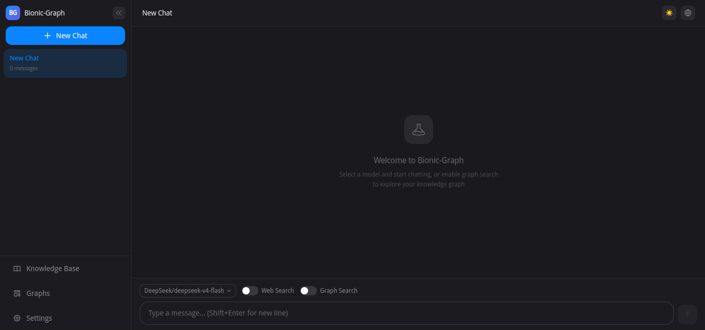
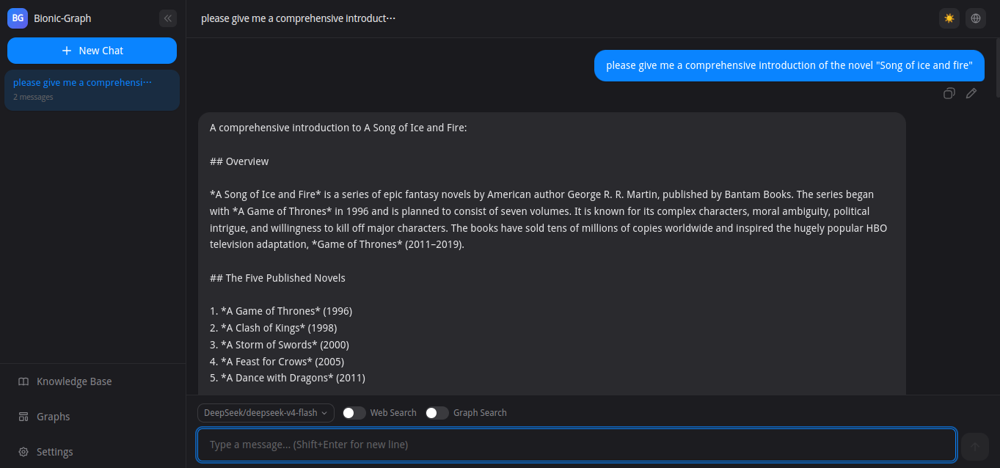
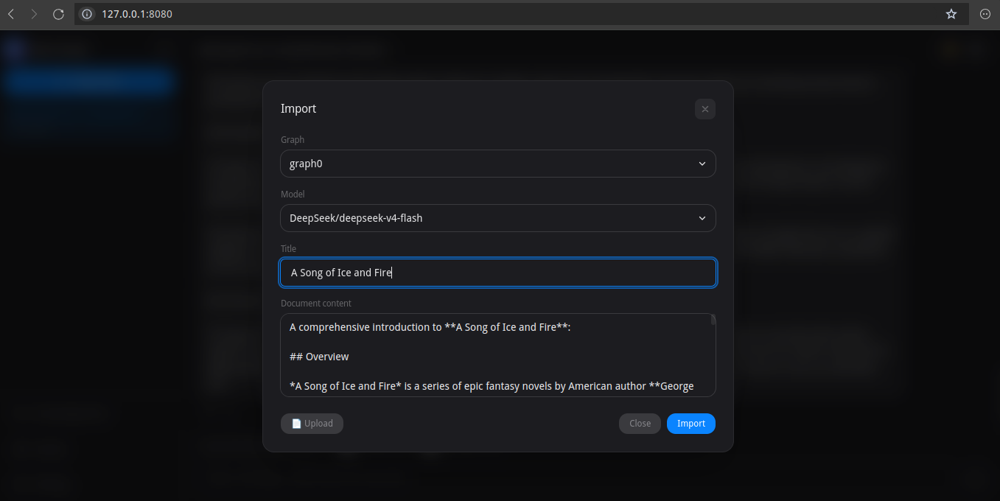
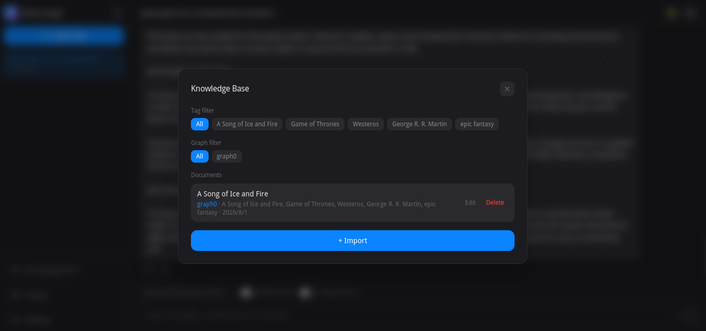
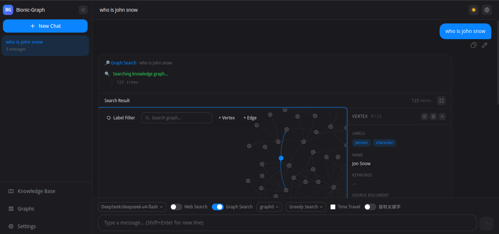
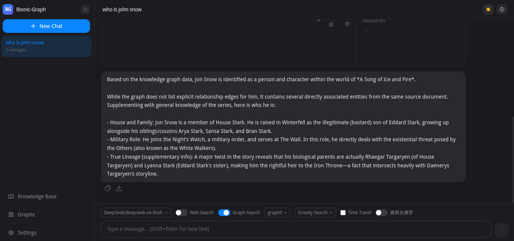
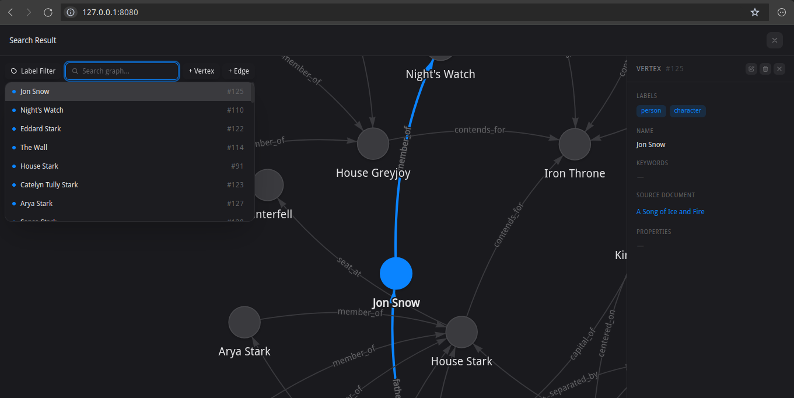
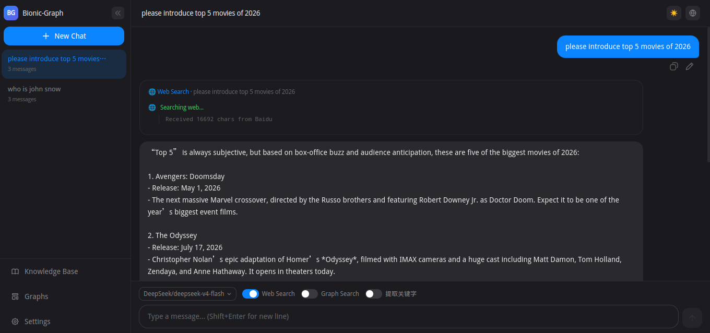

# Bionic-Graph

> **A Graph build for AI Agent**
>
> Pure Rust | Gremlin API | Chat UI | Full-text Search | Bionic Neuronal Spreads Traverse | Time Travel | Self-update Ranking | Custom Property Index |

---

## What it is

Bionic-Graph is an **AI graph engine** built entirely in Rust. It combines a custom block-based storage engine, token-indexed full-text search, and a Gremlin-compatible query pipeline — served with a chat-based AI interface and a React frontend.

Unlike relational or document databases, Bionic-Graph is optimized for **full-text search and attention-based traverse**, which is a typical use case of AI Agent memory recall. The **full-text search** is implemented with a token-indexed inverted index, which is more efficient than graph engines built on top of relational databases. The **attention-based traverse** is implemented with a Bionic Neuronal Spread Traverse, where the entity activation and relation spread are based on the attention scores calculated from relation strength and traverse depth, just like what happens in your brain when recalling memory.

Like the human brain, Bionic-Graph is **self-updating**. A **self-update ranking mechanism** is implemented with a rank-ordered index, which is updated in real-time when a vertex or edge is accessed or updated. 

Unlike the human brain, Bionic-Graph supports **time travel**, which means you can access historical memories at any point in time, like a brain memory snapshot. The time travel search and traverse only happen on the data at that point in time.

There are two examples implemented in the project: one is the **self-awareness** example, which simulates the soul of a human being; the other is the **social activity** example, which simulates the activities of a group of people. Both examples support **plan** and **act**, which are designed to simulate the thinking and acting processes of a human or a community.

### System Architecture

Bionic-Graph is built from the ground up with Rust, organized in five layers from frontend to storage.

```
┌──────────────────────────────────────────────────────────────┐
│            React Frontend (vis-network)                      │
│  Chat UI  |  Graph Visualization  |  KB                      │
│  LLM Chat (SSE)  |  Document Extraction                      │
├──────────────────────────────────────────────────────────────┤
│            REST API + Proxy (axum)                           │
│  /gremlin  |  /vertices  |  /edges  |  /search               │
│  /proxy/openai/*  |  /proxy/web-search                       │
│  /batch/*  |  /documents  |  /tasks                          │
│  /settings/*  |  /graphs                                     │
├──────────────────────────────────────────────────────────────┤
│            Graph Engine (token-indexed)                      │
│  Gremlin (22 steps)  |  BFS+DFS Traversal                    │
│  jieba-rs Tokenizer  |  Lock-safe CRUD                       │
│  Rank/Atime Tracking  |  Time Travel                         │
├──────────────────────────────────────────────────────────────┤
│            In-Memory Index (rebuild on startup)              │
│  BTreeMap (by ID)  |  TokenMap (prefix+word)                 │
│  RankIndex  |  AdjacencyIndex                                │
├──────────────────────────────────────────────────────────────┤
│            Storage Engine (block-based, 16KB)                │
│  DataFile + Bitmap                                           │
│  LRU BlockCache (64MB)  |  WAL Redo Log                      │
│  LockManager (striped RwLock pools)                          │
└──────────────────────────────────────────────────────────────┘
```

### Layers

| Layer | Module | Key Features |
|-------|--------|-------------|
| **Frontend** | `src/ui/` | React 19 + vis-network. Chat UI, graph visualization, knowledge base management. All LLM calls proxied through backend. |
| **REST API** | `src/gremlin/` | 55+ axum routes: graph CRUD, Gremlin queries, settings, document extraction, custom property indices, OpenAI-compatible proxy, web search proxy, async task tracking. All forwarding/broadcasting unified via `ClusterGateway`. |
| **Graph Engine** | `src/graph/` | Gremlin pipeline (22 steps), jieba-rs tokenizer, lock-safe CRUD with WAL, rank/atime tracking, time travel, custom property indices. |
| **In-Memory Index** | `src/storage/` | BTreeMap (by ID), TokenMap (prefix+word), RankIndex, AdjacencyIndex, opt-in property key index. Rebuilt from disk at startup. |
| **Storage Engine** | `src/storage/` | 16KB block-based, 64B fixed records, LRU BlockCache (64MB), WAL redo log with size/time rotation + async background dirty-block flush on rotation, deadlock-free RwLock pools. |
| **Python SDK** | `sdk/python/` | Full REST API client. CLI tool `bgcli` with 12 topics, interactive chat with web + graph search. |

### How it works — a search flow

```
User query: "AI engineer"
       │
       ▼
  Step 1 — Tokenization (jieba-rs)
       │  "AI" → lookup TokenMap → vertex/edge refs
       │  "engineer" → lookup TokenMap → vertex/edge refs
       ▼
  Step 2 — Score & rank (greedy or exact)
       │  Greedy: union of ALL matched entities, scored by frequency
       │  Exact: intersection of entities matching EVERY token
       ▼
  Step 3 — Optional traverse (configurable via SearchSettings)
       │  BFS from search results: score = score * decay * edge_strength
       │  Stop when score < activate. Collect when score >= min_score.
       ▼
  Step 4 — Return ranked results (time-travel filtered if specified)
       │  Soft-deleted entities before `at` timestamp are excluded
       │  Entities created after `at` timestamp are excluded
```

---

## How to

### Quick start (from Release)

Download the pre-built binary and the example config files from GitHub, then start Bionic-Graph:

```bash
# 1. Download the binary
wget https://github.com/agentic-data-ops/bionic-graph/releases/download/v0.1.0/bionic-graph-linux-x64
chmod +x bionic-graph-linux-x64

# 2. Download the example config file (single-node mode)
#    Raw URL: https://raw.githubusercontent.com/agentic-data-ops/bionic-graph/main/examples/config/settings.json
wget https://raw.githubusercontent.com/agentic-data-ops/bionic-graph/main/examples/config/settings.json

# 3. Edit the config to set your LLM API key
nano settings.json
# → Replace "<your-api-key>" under llm.providers[].api_key (and web_search.providers[].headers.Authorization if you use web search)

# 4. Start the server with the config file
./bionic-graph-linux-x64 --config settings.json
# → Open http://127.0.0.1:8080 to access the chat UI
```

The example config (`examples/config/settings.json`) uses DeepSeek as the default LLM provider and Baidu for web search, both with `<your-api-key>` placeholders. Set your API keys before starting. You can also change all settings through the UI at **Settings** tabs.

Once the server is running:

1. **Open** http://127.0.0.1:8080 in your browser
2. **Configure LLM** via Settings dialog (gear icon) → LLM tab, or edit the config file directly
3. **Import documents** into the Knowledge Base (book icon) → upload or paste content
4. **Extract entities** from a document by clicking the extract button — this uses the LLM to parse entities and relations into the graph
5. **Search** the graph using natural language in the chat input — the system performs full-text search and graph traversal, then uses the LLM to answer based on results

### UI Screenshots

| Screenshot | Description |
|------------|-------------|
|  | **Home** — main chat UI with sidebar (conversation list, knowledge base, graph library, settings) |
|  | **LLM Chat** — chatting with the model through the OpenAI-compatible proxy |
|  | **Knowledge Base Import** — upload/paste documents to import into the graph |
|  | **Knowledge Base Extracted** — document after LLM extraction (entities + relations written to the graph) |
|  | **Graph Search** — full-text search + graph traversal results rendered with vis-network |
|  | **Graph Search + LLM Summary** — search results summarized by the LLM in chat |
|  | **Graph Full Screen** — maximized interactive graph view |
|  | **Web Search** — web search results via the configured provider |

> **No Rust toolchain required** — the release binary is a self-contained executable.

### Quick start (cluster mode)

Bionic-Graph supports a **master-worker cluster** architecture for horizontal read scaling. The master handles both reads and writes; workers serve reads locally and forward write requests to the master.

```
┌─────────┐     ┌─────────┐     ┌─────────┐
│ Worker 1│     │ Master  │     │ Worker 2│
│ (R)     │◄────│(R+W)    │────►│ (R)     │
└────┬────┘     └─────────┘     └────┬────┘
     │ ① writes forwarded           │
     └─────────── to master ─────────┘
                 │
     ┌───────────┴───────────┐
     │ ② master broadcasts   │
     │    entries via HTTP    │
     │    to ALL workers      │
     └───────────────────────┘

Touch (rank/atime read sync):
┌─────────┐   POST /cluster/touch   ┌─────────┐   relay   ┌─────────┐
│ Worker  │ ─────────────────────►  │ Master  │ ────────► │ Worker 2│
│ (read V)│     worker→master       │ apply+  │           │ apply   │
└─────────┘                         └─────────┘           └─────────┘
```

**Step 1 — Download the cluster config files** from `examples/config/cluster/`:

```bash
BASE=https://raw.githubusercontent.com/agentic-data-ops/bionic-graph/main/examples/config/cluster
wget $BASE/master.json
wget $BASE/worker1.json
wget $BASE/worker2.json
```

Each file contains the full settings with `<your-api-key>` placeholders. Edit them to set your LLM API keys:

```bash
nano master.json   # llm.providers[].api_key, web_search provider key
nano worker1.json
nano worker2.json
```

> **Fixed IP configuration**: For a cluster spread across machines, set `server.host` to the node's fixed IP, and configure the `cluster` section with fixed IPs — `bind_addr` must be the node's own fixed IP:port (e.g. `"192.168.1.10:9090"`), and on workers `master_addr` must point to the master's fixed IP:port (e.g. `"http://192.168.1.10:9090"`). See [Settings](#settings) for details.

**Step 2 — Start the master node** (read + write, accepts worker connections):

```bash
./bionic-graph-linux-x64 --config master.json
# Master API → http://127.0.0.1:8080
# Cluster endpoint → 127.0.0.1:9090 (for worker heartbeats + replication)
```

**Step 3 — Start worker nodes**:

```bash
# Worker 1 (port 8081)
./bionic-graph-linux-x64 --config worker1.json

# Worker 2 (port 8082)
./bionic-graph-linux-x64 --config worker2.json
```

**How it works:**

| Aspect | Behavior |
|--------|----------|
| **Reads** | Any node (master or worker) can serve read requests (Gremlin, search, vertex/edge queries) |
| **Write forward** | When a write request (vertex/edge/graph/document/settings/index CRUD) arrives at a worker, the handler forwards it to the master via `ClusterGateway::forward()` — the worker does not apply it locally. The master executes the write and returns the result to the worker, which passes it back to the caller. |
| **Write broadcast** | After the master executes a write, it broadcasts the request to ALL known workers (including offline ones) via `ClusterGateway::broadcast()` → persistent FIFO queue (durable, at-least-once). An async consumer delivers queued entries in order to each worker (POST `/cluster/execute`); workers apply the entry into their own WAL and graph, so every node converges to the same state. Offline workers catch up automatically when they come back. |
| **Heartbeat** | Workers send periodic heartbeats to the master (every 5s by default) carrying their local graph list; the master detects missing/inconsistent graphs and issues sync commands (CreateGraph/UpdateGraphMeta/UpdateGraphConfig/DeleteGraph/SetDefaultGraph). Worker `node_id` must be unique — two workers with the same ID will overwrite each other in master's registry. |
| **Node persistence** | The master persists the cluster topology to `<data_dir>/cluster/nodes.json` on every heartbeat; on startup it loads known workers and waits for them to register (timeout, then degrades to available nodes). |
| **Data isolation** | Each node has its own `data/` directory — workers sync via write broadcast, not shared storage |
| **Rank/Atime sync** | Read access triggers touch: worker→master reports the read via HTTP POST `/cluster/touch`, then master applies locally + **relay-broadcasts** to all workers. Each node updates its own DataHeader in-place (no WAL). |

> **Note:** The cluster module is functional but not yet optimized for production. Leader election, automatic worker discovery, and cluster-aware routing are planned enhancements. For development and evaluation, start with a single-node setup (`"enabled": false`).

### Clone & build

```bash
git clone <repo-url>
cd bionic-graph

# The frontend is built and embedded during cargo build
cargo build --release
```

### Run

```bash
cargo run --release
# → Open http://127.0.0.1:8080 to access the chat UI
# → API available at the same address
```

After frontend changes, `touch src/ui_serve.rs` is required to force Rust recompilation (rust-embed doesn't auto-detect `dist/` changes).

### Commands

| Command | Description |
|---------|-------------|
| `cargo run` | Start server (API + frontend) |
| `cargo test` | Rust unit tests (84+) |
| `npm --prefix src/ui run dev` | Frontend dev server (standalone Vite, proxies to port 8080) |
| `npm --prefix src/ui run build` | Build frontend only |
| `npm --prefix src/ui run test` | Frontend tests (vitest) |

### CLI flags

| Flag | Default | Description |
|------|---------|-------------|
| `-d, --data-dir` | from settings | Data directory (overrides config) |
| `-H, --host` | from settings | HTTP bind address |
| `-P, --port` | from settings | HTTP port |
| `--config` | `~/.config/bionic-graph/settings.json` | Config file path |


### Settings

Auto-created at `~/.config/bionic-graph/settings.json` if not present. Example configs are also provided in `examples/config/` — `settings.json` for single-node mode and `examples/config/cluster/{master,worker1,worker2}.json` for cluster mode.

> **Cluster mode**: When running a cluster (`cluster.enabled: true`), configure the `cluster` section with **fixed IPs** instead of loopback addresses — set `bind_addr` to the node's own fixed IP:port (e.g. `"192.168.1.10:9090"`), and on workers set `master_addr` to the master's fixed IP:port (e.g. `"http://192.168.1.10:9090"`). Each node also needs a distinct `server.port` (e.g. master `8080`, workers `8081`/`8082`).

| Internet field | Type | Default | Description |
|-------------|------|---------|-------------|
| `proxy` | `string` or `null` | `null` | HTTP proxy URL, e.g. `"http://127.0.0.1:7890"`. All LLM and web search requests go through this proxy when set. |
| `ssl_verify` | `bool` | `true` | Verify SSL certificates for LLM and web search requests. Set to `false` to accept self-signed or untrusted certificates. |

```json
{
  "server": { "host": "127.0.0.1", "port": 8080 },
  "llm": {
    "providers": [{
      "name": "DeepSeek",
      "api_base_url": "https://api.deepseek.com/v1",
      "api_key": "<your-api-key>",
      "models": ["deepseek-v4-flash", "deepseek-v4-pro"]
    }],
    "default_model": "DeepSeek/deepseek-v4-flash",
    "context_window": 1000000,
    "max_output_tokens": 384000,
    "max_retries": 3
  },
  "cluster": {
    "enabled": false,
    "role": "master",
    "bind_addr": "127.0.0.1:9090",
    "master_addr": null,
    "heartbeat_interval_secs": 5,
    "worker_timeout_secs": 30
  },
  "internet": {
    "proxy": null,
    "ssl_verify": true
  },
  "web_search": {
    "default_provider": "Baidu",
    "providers": [{
      "name": "Baidu",
      "search_url": "https://qianfan.baidubce.com/v2/ai_search/web_search",
      "method": "POST",
      "body_template": "{\"messages\":[{\"content\":\"{text}\",\"role\":\"user\"}],\"search_source\":\"baidu_search_v2\",\"resource_type_filter\":[{\"type\":\"web\",\"top_k\":10}],\"search_recency_filter\":\"year\",\"block_websites\":[\"baijiahao.baidu.com\"]}",
      "params": {},
      "headers": {
        "Content-Type": "application/json",
        "Authorization": "Bearer <your-api-key>"
      }
    }]
  },
  "graph": {
    "storage": { "data_dir": "data" },
    "search": {
      "greedy": {
        "traverse": true, "match_mode": "prefix",
        "activate": 0.2, "decay": 0.95, "depth": 16, "score": 0.1
      },
      "exact": {
        "traverse": true, "match_mode": "word",
        "activate": 0.6, "decay": 0.8, "depth": 4, "score": 0.2
      }
    },
    "rank": {
      "auto_inc_rank_when_update": true,
      "auto_inc_rank_when_read": true,
      "auto_dec_rank_when_inactive": true,
      "inactive_after_accessed_secs": 1296000,
      "inactive_rank_update_period": 86400
    }
  }
}
```

### Use the API

All CRUD, Gremlin, search, batch, and document endpoints use `X-Graph-Name` HTTP header to specify the graph. Falls back to `graph0` when omitted.

#### Graph management

```bash
# List graphs
curl localhost:8080/graphs

# Create a graph
curl -X POST localhost:8080/graphs \
  -H 'Content-Type: application/json' \
  -d '{"name":"mygraph"}'

# Set default graph
curl -X PUT localhost:8080/graphs \
  -H 'Content-Type: application/json' \
  -d '{"name":"mygraph"}'

# Update graph metadata (description, time_travel)
curl -X PUT localhost:8080/graphs/mygraph \
  -H 'Content-Type: application/json' \
  -d '{"description":"My knowledge graph","time_travel":true}'

# Delete a graph
curl -X DELETE localhost:8080/graphs/mygraph

# Per-graph config
curl localhost:8080/graphs/mygraph/config
```

#### Vertex CRUD

```bash
# Create a vertex (returns its ID)
curl -X POST localhost:8080/vertices \
  -H 'Content-Type: application/json' \
  -H 'X-Graph-Name: mygraph' \
  -d '{"name":"Alice","keywords":["engineer","manager"],"labels":["person"],"properties":{"department":"Engineering"}}'

# Update a vertex
curl -X PUT localhost:8080/vertices/1 \
  -H 'Content-Type: application/json' \
  -H 'X-Graph-Name: mygraph' \
  -d '{"name":"Alice Smith","keywords":["engineer","lead"],"labels":["person","employee"]}'

# Soft delete (requires time travel enabled)
curl -X DELETE localhost:8080/vertices/1 \
  -H 'X-Graph-Name: mygraph'

# Hard delete
curl -X DELETE 'localhost:8080/vertices/1?force=true' \
  -H 'X-Graph-Name: mygraph'

# Get vertex metadata (status, version, ctime, mtime, atime, rank)
curl localhost:8080/vertices/1/meta \
  -H 'X-Graph-Name: mygraph'

# Update vertex metadata (rank, atime)
curl -X PUT localhost:8080/vertices/1/meta \
  -H 'Content-Type: application/json' \
  -H 'X-Graph-Name: mygraph' \
  -d '{"rank":10,"atime":1718000000}'
```

#### Edge CRUD

```bash
# Create an edge (returns its ID)
curl -X POST localhost:8080/edges \
  -H 'Content-Type: application/json' \
  -H 'X-Graph-Name: mygraph' \
  -d '{"source":1,"target":2,"name":"works_with","labels":["relationship"],"keywords":["colleague"],"strength":0.8,"properties":{"since":"2024"}}'

# Update an edge
curl -X PUT localhost:8080/edges/1 \
  -H 'Content-Type: application/json' \
  -H 'X-Graph-Name: mygraph' \
  -d '{"name":"manages","strength":0.9}'

# Delete edge
curl -X DELETE localhost:8080/edges/1 \
  -H 'X-Graph-Name: mygraph'

# Hard delete
curl -X DELETE 'localhost:8080/edges/1?force=true' \
  -H 'X-Graph-Name: mygraph'

# Get edge metadata
curl localhost:8080/edges/1/meta \
  -H 'X-Graph-Name: mygraph'

# Update edge metadata
curl -X PUT localhost:8080/edges/1/meta \
  -H 'Content-Type: application/json' \
  -H 'X-Graph-Name: mygraph' \
  -d '{"rank":5}'
```

#### Token search + traversal

```bash
# Search with auto traverse (based on graph search settings)
curl -X POST localhost:8080/gremlin \
  -H 'Content-Type: application/json' \
  -H 'X-Graph-Name: mygraph' \
  -d '{"steps":[
    {"step":"search","text":"AI engineer"}
  ]}'

# Advanced pipeline with explicit steps
curl -X POST localhost:8080/gremlin \
  -H 'Content-Type: application/json' \
  -H 'X-Graph-Name: mygraph' \
  -d '{"steps":[
    {"step":"search","text":"AI engineer","mode":"greedy"},
    {"step":"out","labels":["works_at"],"depth":2},
    {"step":"limit","count":10}
  ]}'

# Time travel query (via X-Time-Travel header)
curl -X POST localhost:8080/gremlin \
  -H 'Content-Type: application/json' \
  -H 'X-Graph-Name: mygraph' \
  -H 'X-Time-Travel: 1718000000000000' \
  -d '{"steps":[
    {"step":"search","text":"project"}
  ]}'

# Expand vertex (neighbors + edges)
curl -X POST localhost:8080/gremlin \
  -H 'Content-Type: application/json' \
  -H 'X-Graph-Name: mygraph' \
  -d '{"steps":[
    {"step":"V","ids":[1]},
    {"step":"expand","depth":1}
  ]}'

# Shorthand search via GET
curl 'localhost:8080/search?text=AI+engineer&mode=greedy&limit=10'
```

#### Web Search & LLM Proxy

```bash
# Web search via proxy
curl -X POST localhost:8080/proxy/web-search \
  -H 'Content-Type: application/json' \
  -d '{"query":"Game of Thrones characters"}'

# Specify a different provider
curl -X POST localhost:8080/proxy/web-search \
  -H 'Content-Type: application/json' \
  -d '{"query":"winterfell","provider":"Bing"}'

# List available LLM models
curl localhost:8080/proxy/openai/v1/models

# OpenAI-compatible chat completion
curl -X POST localhost:8080/proxy/openai/v1/chat/completions \
  -H 'Content-Type: application/json' \
  -d '{"model":"DeepSeek/deepseek-v4-flash","messages":[{"role":"user","content":"Hello"}]}'
```

#### Settings

```bash
# Graph search config (greedy/exact modes, traversal settings)
curl localhost:8080/settings/graph/search

# Update search config
curl -X PUT localhost:8080/settings/graph/search \
  -H 'Content-Type: application/json' \
  -d '{"greedy":{"traverse":true,"match_mode":"prefix","activate":0.2,"decay":0.95,"depth":16,"score":0.1},"exact":{"traverse":true,"match_mode":"word","activate":0.6,"decay":0.8,"depth":4,"score":0.2}}'

# Rank decay config
curl localhost:8080/settings/graph/rank

# LLM provider config
curl localhost:8080/settings/llm

# Web search providers
curl localhost:8080/settings/web-search

# Tokenizer custom dictionary (list words)
curl localhost:8080/settings/tokenizer/words

# Add custom tokenizer word
curl -X POST localhost:8080/settings/tokenizer/words \
  -H 'Content-Type: application/json' \
  -d '{"words":["knowledge-graph","neural-network"]}'

# Remove custom tokenizer word
curl -X DELETE localhost:8080/settings/tokenizer/words \
  -H 'Content-Type: application/json' \
  -d '{"words":["neural-network"]}'
```

#### Document management

```bash
# Add a document (returns id)
curl -X POST localhost:8080/documents \
  -H 'Content-Type: application/json' \
  -d '{"title":"my-doc","content":"# Hello\nWorld","tags":["test"]}'

# List documents
curl localhost:8080/documents

# Get document metadata
curl localhost:8080/documents/<id>

# Update document metadata
curl -X PUT localhost:8080/documents/<id> \
  -H 'Content-Type: application/json' \
  -d '{"title":"new-title","tags":["updated"]}'

# Delete document (clean=true also removes associated graph vertices/edges)
curl -X DELETE 'localhost:8080/documents/<id>?clean=true'

# In cluster mode, documents are automatically synced to all workers with the
# same UUID. Extraction tags and graph association are also broadcast.

# Get document content
curl localhost:8080/documents/<id>/content

# Submit extraction task for a document
curl -X POST localhost:8080/documents/<id>/extract \
  -H 'X-Graph-Name: mygraph'
```

#### Tasks management

```bash
# List tasks
curl localhost:8080/tasks

# Poll task status
curl localhost:8080/tasks/<task_id>
```

#### Batch operations

```bash
# Batch import vertices/edges (upsert by name)
curl -X POST localhost:8080/batch/load \
  -H 'Content-Type: application/json' \
  -H 'X-Graph-Name: mygraph' \
  -d '{"update_existing":true,"vertices":[{"name":"Alice","labels":["person"]},{"name":"Bob","labels":["person"]}],"edges":[{"source":"Alice","target":"Bob","name":"knows"}]}'

# Batch delete by name
curl -X POST localhost:8080/batch/delete \
  -H 'Content-Type: application/json' \
  -H 'X-Graph-Name: mygraph' \
  -d '{"vertices":["Alice","Bob"],"edges":[{"source":"Alice","target":"Bob","name":"knows"}]}'
```

#### All REST endpoints

| Method | Path | Description |
|--------|------|-------------|
| `GET` | `/health` | System health |
| `GET` | `/graphs` | List graphs |
| `POST` | `/graphs` | Create a graph |
| `PUT` | `/graphs` | Set default graph |
| `DELETE` | `/graphs/:name` | Delete a graph |
| `PUT` | `/graphs/:name` | Update graph metadata |
| `GET/PUT` | `/graphs/:name/config` | Per-graph storage, lock & indices config |
| `POST` | `/gremlin` | Gremlin pipeline query |
| `GET` | `/search` | Token search shortcut (`?text=&mode=&limit=`) |
| `POST` | `/vertices` | Create a vertex |
| `PUT` | `/vertices/:id` | Update a vertex |
| `DELETE` | `/vertices/:id` | Delete a vertex (`?force=true` for hard delete) |
| `GET/PUT` | `/vertices/:id/meta` | Get/update vertex metadata (rank, atime) |
| `POST` | `/edges` | Create an edge |
| `PUT` | `/edges/:id` | Update an edge |
| `DELETE` | `/edges/:id` | Delete an edge (`?force=true` for hard delete) |
| `GET/PUT` | `/edges/:id/meta` | Get/update edge metadata (rank, atime) |
| `GET/PUT` | `/settings/graph/search` | Search settings (greedy/exact config) |
| `GET/PUT` | `/settings/graph/rank` | Rank decay config |
| `GET/PUT` | `/settings/llm` | LLM provider config |
| `GET/PUT` | `/settings/web-search` | Web search provider config |
| `POST` | `/proxy/web-search` | Web search proxy |
| `GET/POST/DELETE` | `/settings/tokenizer/words` | List / add / remove custom tokenizer words |
| `POST/GET/DELETE` | `/indices/vertex/properties` | Register / list / unregister vertex property index keys |
| `GET/DELETE` | `/indices/vertex/properties/:key` | Show stats / unregister a specific vertex property key |
| `POST/GET/DELETE` | `/indices/edge/properties` | Register / list / unregister edge property index keys |
| `GET/DELETE` | `/indices/edge/properties/:key` | Show stats / unregister a specific edge property key |
| `GET` | `/documents` | List documents |
| `POST` | `/documents` | Create a document |
| `GET/PUT/DELETE` | `/documents/:id` | Get/update/delete document metadata |
| `GET` | `/documents/:id/content` | Get document body |
| `POST` | `/documents/:id/extract` | Extract from document by ID |
| `GET` | `/tasks` | List all tasks |
| `GET` | `/tasks/:task_id` | Poll task status |
| `POST` | `/batch/load` | Batch import vertices/edges (upsert by name) |
| `POST` | `/batch/delete` | Batch delete vertices/edges by name |
| `GET` | `/proxy/openai/v1/models` | List LLM models |
| `POST` | `/proxy/openai/v1/chat/completions` | OpenAI-compatible chat proxy (SSE) |

### Supported Gremlin steps

All Gremlin queries are sent via `POST /gremlin` with a `steps` array. Two optional HTTP headers control the execution context:

| Header | Description |
|--------|-------------|
| `X-Graph-Name` | Target graph name (default: `graph0`) |
| `X-Time-Travel` | Microsecond timestamp for point-in-time queries. All steps execute against the graph state at that moment. |

| Step | Parameters | Description |
|------|-----------|-------------|
| `search` | `text`, `mode?`, `match_mode?`, `limit?`, `min_rank?` | Token-indexed full-text search. `mode` = `"greedy"` (union of any token match) or `"exact"` (intersection — must match all tokens). `match_mode` = `"prefix"` or `"word"`. Auto-injects `match_mode` from graph search settings + optional `traverse` step. |
| `V` | `ids?`, `limit?` | All vertices or filtered by ID array. `limit` uses the rank index to return top-N vertices. |
| `E` | `ids?`, `limit?` | All edges or filtered by ID array. `limit` uses the rank index to return top-N edges. |
| `has` | `key`, `value` | Filter results by exact property key-value match. `value` supports any JSON type (string, number, boolean, array, object). |
| `hasNot` | `key`, `value` | Negated property filter — exclude if property matches. `value` supports any JSON type. |
| `hasKey` | `key` | Filter by property key existence. |
| `hasLabel` | `label` | Filter by labels array (checks both Vertex.labels and Edge.labels). |
| `hasName` | `name`, `source_name?`, `target_name?` | Look up a vertex or edge by name via the `vertex_name`/`edge_name` index. For edges, optionally narrow by `source_name` and `target_name`. |
| `out` | `depth?`, `labels?` | BFS traversal to outgoing neighbor vertices. `labels` filters by target vertex labels. `depth` controls BFS depth (default 1). |
| `in` | `depth?`, `labels?` | BFS traversal to incoming neighbor vertices. |
| `both` | `depth?`, `labels?` | Bidirectional BFS traversal (out + in, deduplicated). |
| `outE` | `labels?` | Outgoing edges as Edge results. `labels` filters by Edge.labels array. |
| `inE` | `labels?` | Incoming edges as Edge results. `labels` filters by Edge.labels array. |
| `bothE` | `labels?` | Both-direction edges as Edge results (outE + inE, deduplicated). |
| `values` | `keys?` | Extract specific property keys from each result (filters to listed keys). |
| `limit` | `count` | Cap number of results to `count`. |
| `count` | — | Replace results with a single `{count: N}` item. |
| `dedup` | — | Deduplicate results by ID (removes duplicate vertices/edges). |
| `repeat` | `steps`, `times` | Execute sub-pipeline `steps` iteratively `times` times. |
| `expand` | `depth?`, `label?` | From each vertex, add its neighbor vertices + connecting edges to results (both directions). Optional `label` filters by edge label. |
| `traverse` | `decay?`, `activate?`, `max_depth?`, `min_score?` | BFS activation spread from input vertices. Score = parent_score × `decay` × edge_strength. Stops when score < `activate`. Collects results with score >= `min_score`. Defaults: decay=0.95, activate=0.2, max_depth=16, min_score=0.1. Both endpoints of each traversed edge must meet min_score threshold (edge score = average of its endpoints). |
| `rank` | `limit?`, `min?` | Return top results by rank. As source step: iterate rank index descending. As filter step: sort existing results by rank. `min` sets minimum rank threshold (inclusive). |

## Project structure

```
src/
├── main.rs                    # CLI entry + HTTP server
├── lib.rs                     # Library exports
├── config/                    # File-based configuration
│   ├── loader.rs              # JSON load/save with env overrides
│   └── settings.rs            # Settings structs (server, llm, cluster, web_search, graph)
├── storage/                   # Block-based storage engine
│   ├── types.rs               # Constants, enums, binary layouts
│   ├── data_file.rs           # 16KB block I/O
│   ├── bitmap_file.rs         # Block-level free space tracking
│   ├── block_allocator.rs     # Chunk-level allocator
│   ├── block_cache.rs         # LRU cache with dirty tracking
│   ├── redo_log.rs            # WAL: FIFO queue + batch writer, rotation, background flush, CRC32, replay
│   ├── memory_index.rs        # In-memory BTreeMap/HashMap indexes
│   └── memory_index_builder.rs # Index rebuild by scanning data file at startup
├── lock/                      # Concurrency lock manager
│   └── lock_manager.rs        # Striped RwLock pools (parking_lot)
├── graph/                     # Graph engine
│   ├── graph.rs               # Graph struct (facade), open/close
│   ├── graph_registry.rs      # Graph metadata registry
│   ├── crud.rs                # Vertex/Edge CRUD + WAL + tokenize
│   ├── gremlin.rs             # Gremlin pipeline (22 steps)
│   ├── locked.rs              # Lock-safe CRUD wrappers
│   ├── serialize.rs           # Bincode + JSON properties
│   ├── tokenizer.rs           # jieba-rs tokenizer
│   └── tests.rs               # Integration tests
├── gremlin/                   # REST API (axum)
│   ├── mod.rs                 # 55+ route handlers
│   ├── settings.rs            # /settings/graph/search, /settings/llm, /settings/graph/rank, /settings/web-search, /web-search/proxy
│   ├── tokenizer_settings.rs  # /settings/tokenizer/words (GET/POST/DELETE)
│   └── indices.rs             # /indices/vertex|edge/properties (POST/GET/DELETE)
├── extract/                   # Document extraction pipeline
│   ├── config.rs, document.rs, extraction.rs
│   ├── llm_client.rs, task_manager.rs
├── documents.rs               # Document CRUD manager
├── graph_manager.rs           # Multi-graph lifecycle
├── maas/                      # MaaS OpenAI-compatible proxy
├── cluster/                   # Master-worker cluster (server, registry, gateway, queue, replication)
│   ├── server.rs              # Heartbeat, forward, replicate, touch
│   ├── node.rs                # NodeRegistry + nodes.json persistence + graph sync
│   ├── forward.rs             # Write forwarding
│   ├── request.rs             # Unified ClusterRequest model
│   ├── gateway.rs             # ClusterGateway — unified forward/broadcast
│   ├── broadcast_queue.rs     # Persistent FIFO broadcast queue (plan 6.3)
│   └── replication.rs         # Redo-log replication
├── ui_serve.rs                # Embedded frontend serving
├── ui/                        # React frontend
│   ├── src/
│   │   ├── components/
│   │   │   ├── Sidebar.jsx, ChatArea.jsx, MessageList.jsx
│   │   │   ├── ChatInput.jsx, GraphViewer.jsx
│   │   │   ├── GraphManagerDialog.jsx, KnowledgeBase.jsx
│   │   │   ├── SettingsDialog.jsx, PropertyPanel.jsx
│   │   └── api.js, App.jsx, locales/
│   └── dist/                  # Compiled (embedded in binary)
├── sdk/
│   └── python/                # Python SDK (Client + CLI bgcli)
│       ├── pyproject.toml
│       ├── bionic_graph/      # Client library + CLI
│       └── tests/             # SDK unit tests
└── examples/
    ├── self_awareness/        # Self-awareness KG pipeline
    └── social_activities/     # Social activities KG pipeline
```

---

## Design principles

1. **Single binary** — frontend embedded via rust-embed, one `cargo run` to start
2. **All LLM proxied** — chat, semantic search, document extraction go through MaaS proxy
3. **Pure Rust backend** — zero external NN libraries, custom block-based storage
4. **CPU inference** — all computation in memory, no GPU
5. **Token-indexed search** — jieba-rs tokenization replaces old neural network index
6. **Custom storage engine** — 16KB blocks, 64B chunks, LRU cache, WAL with crash recovery
7. **Gremlin-compatible** — standard graph query interface with 22 pipeline steps
8. **Time travel** — per-vertex MVCC via soft-delete, point-in-time queries
9. **Multi-graph** — multiple named graphs, isolated `data/graphs/<name>/` directories
10. **Fine-grained concurrency** — striped RwLock pools with deadlock-free ordering
11. **Web Search** — backend proxy for web search, configurable providers (Bing, Baidu API). LLM extracts keywords before searching for better results.
12. **Custom Property Indices** — opt-in per-key property index on vertices/edges, persisted in per-graph `config.json`. Crash-proof: auto-rebuilt from data file on restart.
12. **Python SDK** — `pip install git+https://github.com/agentic-data-ops/bionic-graph.git#subdirectory=sdk/python`, full REST API client with CLI tool `bgcli` and interactive chat mode.
13. **Batch operations** — `/batch/load` and `/batch/delete` for bulk upsert/delete by vertex name.
14. **Examples** — self-awareness KG (`examples/self_awareness/`) and social activities KG (`examples/social_activities/`) with LLM-driven load/plan/act pipelines.

## Python SDK & CLI

A complete Python client library and CLI tool are available in `sdk/python/`:

```bash
# Install from GitHub
pip install git+https://github.com/agentic-data-ops/bionic-graph.git#subdirectory=sdk/python

# CLI usage — 12 command groups
bgcli --base-url http://127.0.0.1:8080 health check

# Graph management
bgcli graph list
bgcli graph create --name mygraph
bgcli graph set-default --name mygraph
bgcli graph delete --name mygraph
bgcli graph update-meta --name mygraph --description "My KG" --time-travel

# Vertex CRUD
bgcli vertex create --name "Eddard Stark" --labels '["person"]' --graph got
bgcli vertex update --id 1 --name "Ned Stark" --graph got
bgcli vertex delete --id 1 --graph got
bgcli vertex get-meta --id 1 --graph got
bgcli vertex update-meta --id 1 --rank 10 --graph got

# Edge CRUD
bgcli edge create --source 1 --target 2 --name knows --labels '["relationship"]' --graph got
bgcli edge update --id 1 --name "friends_with" --graph got
bgcli edge delete --id 1 --graph got
bgcli edge get-meta --id 1 --graph got
bgcli edge update-meta --id 1 --rank 5 --graph got

# Full-text search (top-level command)
bgcli search --text "Stark" --mode greedy --graph got

# Gremlin pipeline
bgcli gremlin execute --steps '[{"step":"V","ids":[1]}]'

# Document management
bgcli document list
bgcli document create --title "my-doc" --content "# Hello" --tags '["test"]'
bgcli document get --id doc-123
bgcli document update --id doc-123 --title "new-title"
bgcli document delete --id doc-123
bgcli document get-content --id doc-123
bgcli document extract --doc-id doc-123 --graph got

# Async task tracking
bgcli task list
bgcli task get --task-id t1
bgcli task wait --task-id t1

# Settings
bgcli settings get-search
bgcli settings set-search --config '{"greedy":{"match_mode":"prefix"},"exact":{"match_mode":"word"}}'
bgcli settings get-llm
bgcli settings set-llm --providers '[{"name":"DeepSeek","api_base_url":"https://api.deepseek.com/v1","api_key":"<your-api-key>","models":["deepseek-v4-flash"]}]'
bgcli settings get-rank
bgcli settings set-rank --config '{"auto_inc_rank_when_read":false}'
bgcli settings get-web-search
bgcli settings set-web-search --config '{"default_provider":"Baidu","providers":[{"name":"Baidu","search_url":"..."}]}'

# Proxy services
bgcli proxy web-search --query "Game of Thrones" --provider Baidu
bgcli proxy openai-models
bgcli proxy openai-chat --messages '[{"role":"user","content":"Hello"}]' --model "DeepSeek/deepseek-v4-flash"

# Batch operations (JSON file-based)
bgcli batch load --graph mygraph --data data.json      # entities + relations
bgcli batch delete --graph mygraph --data delete.json   # vertices + edges

# Interactive chat with web + graph search
bgcli chat --model "DeepSeek/deepseek-v4-flash" --web-search --graph-search
```

### From Python code

```python
from bionic_graph import Client
client = Client()
resp = client.create_vertex("Jon Snow", labels=["person", "stark"])
print(f"Created vertex {resp.id}")
```

See `sdk/python/SKILL.md` for full documentation.

---

## Examples

Two example pipelines demonstrating LLM-driven knowledge graph construction and simulation.

> **LLM calls are streamed**: All three phases call the LLM in streaming mode (`stream=True`) — the response is written chunk-by-chunk to a temp file (`<output>.tmp`), validated as JSON when complete, and **no retries** are performed. Any LLM/transport error or invalid JSON aborts the command with a non-zero exit code. See each example's `README.md` (LLM Interaction section) for details.

### Self-awareness (`examples/self_awareness/`)

Simulates the "soul" of a human being — loads a self-description document, generates life plans, and simulates activities.

```bash
cd examples/self_awareness

# Phase 1: Load self-description from Markdown into the graph
python3 cli.py load --md self_soul.md --graph self-awareness --model "DeepSeek/deepseek-v4-flash"

# Phase 2: Reflect on graph state and generate next-phase plans
python3 cli.py plan --graph self-awareness --model "DeepSeek/deepseek-v4-flash"

# Phase 3: Execute top-N activities sorted by rank
python3 cli.py act --count 3 --graph self-awareness --model "DeepSeek/deepseek-v4-flash"
```

| Command | Description | Key Options |
|---------|-------------|-------------|
| `load` | Extract entities/relations from Markdown and load into graph | `--md` (default: `self_soul.md`), `--graph`, `--model`, `--force` |
| `plan` | Search graph for interests, generate plans via LLM, load into graph | `--graph`, `--model` |
| `act` | Fetch top plans by rank, simulate activities, update statuses | `--count` (default: 3), `--graph`, `--model` |

All commands support `--base-url` (default `http://127.0.0.1:8080`) and `--output` for saving results to JSON.

### Social activities (`examples/social_activities/`)

Simulates group social dynamics — loads a group profile, plans joint activities, and simulates execution.

```bash
cd examples/social_activities

# Phase 1: Load social activity descriptions from Markdown
python3 cli.py load --md social_activities.md --graph social-graph --model "DeepSeek/deepseek-v4-flash"

# Phase 2: Generate new social activity plans
python3 cli.py plan --graph social-graph --model "DeepSeek/deepseek-v4-flash"

# Phase 3: Simulate social activity execution
python3 cli.py act --count 3 --graph social-graph --model "DeepSeek/deepseek-v4-flash"
```

| Command | Description | Key Options |
|---------|-------------|-------------|
| `load` | Extract group profiles and activity templates from Markdown | `--md` (default: `social_activities.md`), `--graph`, `--model`, `--force` |
| `plan` | Search graph for activity plans, generate new ones via LLM | `--graph`, `--model` |
| `act` | Fetch top plans by priority, simulate execution, update results | `--count` (default: 3), `--graph`, `--model` |

All commands support `--base-url` (default `http://127.0.0.1:8080`) and `--output` for saving results to JSON.

---

## License

MIT
